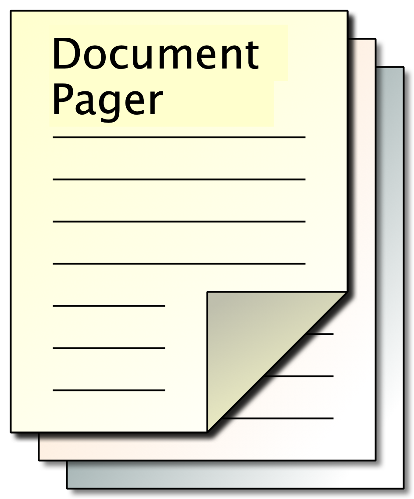

#	Document Pager 0.3.5



Document Pager © Mark Simon  
https://github.com/manngo/document-pager

##What does it do?

Displays and Pages a document which is sectioned using a special heading pattern.

##Preparing the Document

Your document should include headings which are generally comments which follow a pattern.

Currently, the default pattern is:

| Document | Main Heading       | Sub Heading       |
|----------|--------------------|-------------------|
| Text     | `## Main Heading`  | `### Sub Heading` |
| Coding   | `/** Main Heading` | `/* Sub Heading`  |

Note that the `/*` style comment is a block comment. The heading will only extend to the end of the line.

##	Viewing the Document

###	Opening the Document

Naturally, you will first need to open the document. You can open a document from the local file system or from the Internet.

| Operation         | Menu       | Keyboard Shortcut |
|-------------------|------------|-------------------|
| Open a Local File | Open …     | <span><kbd>⌘</kbd><kbd>O</kbd></span> or <span><kbd>⌃</kbd><kbd>O</kbd></span>          |
| Open a URL        | Open URL … | <span><kbd>⌘</kbd><kbd>⇧</kbd><kbd>O</kbd></span> or <span><kbd>⌃</kbd><kbd>⇧</kbd><kbd>O</kbd></span>        |


###	Navigating the Document

The headings will appear on the left.

By default, the code samples are syntax-highlighted (except, of course, for Text files). If you need to copy some of the code, this will interfere with your copy.

To view the unhighlighted version, you can either:

- option/alt-click on the title
- Turn off the Highlight Syntax button
- Click on the Raw button near the content.

###	Full(ish) Screen

On the control bar, there is a button `Full Screen`. This will remove all the bits around the main content.

If you want true full screen, you will need to use the operating system’s full screen feature as well.

- You can navigate through the pages using the <span><kbd>←</kbd></span> or <span><kbd>→</kbd></span> keys.
- You can go to the first or last page using the <span><kbd>↑</kbd></span> or <span><kbd>↓</kbd></span> keus.
- You can get back to normal by pressing the <span><kbd>Esc</kbd></span> key.

##	Preferences

Document Pager will create a folder in the user’s home directory called `.document-pager`. It includes:

| File             | Usage                        |
|------------------|------------------------------|
| `languages.json` | Additional Language Settings |
| `files.json`     | A list of last open files    |
| `state.json`     | Other state values           |

as well as some others to remember what you’ve done.

###	Additional Headings

If you want to add your own heading markers, you should add them to the `languages.json` file using the following pattern:

```js
{
	"language": {
		"extensions": ["…"],
		"breaks" { "major": ["…"], "minor": ["…"] }
	}
}
```

You can omit any of the sub sections, and you can have multiple values inside the square brackets.

As you might have guessed from the name, the file is in JSON format. JSON is very fussy, so it’s easy to make a mistake.

Here are the default language settings:

```js
{
	"javascript": {
		"extensions": ["js","javascript"],
		"breaks": { "major": ["/**"], "minor": ["/*"]}
	},
	"php": {
		"extensions": ["php"],
		"breaks": { "major": ["/**","/*:"], "minor": ["/*"] }
	},
	"sql": {
		"extensions": ["sql"],
		"breaks": { "major": ["/**"], "minor": ["/*"] }
	},
	"css": {
		"extensions": ["css"],
		"breaks": { "major": ["/**"], "minor": ["/*"] }
	},
	"markdown": {
		"extensions": ["md","markdown","mds"],
		"breaks": { "major": ["##"]}
	},
	"text": {
		"extensions": ["txt","text","*"],
		"breaks": { "major": ["#"], "minor": ["##"] }
	}

}
```

These default settings are not in the `languages.json` file, but are built-in.

##	MarkDown Documents

You can also page through MarkDown documents. Here the `##` heading is used for paging.

Markdown files are recognised by the following extensions: `.md`, `.markdown` and `.mds`, or others if you’re prepared to add your own to the `languages.json` file.

The `.mds` extension is for a future enhancement.

###	Special Headings

Markdown headings can take the following non-standard format:

```md
	##id.class
```

This generates HTML in the following format:

```html
	<h2 id="…" class="…"> … </h2>
```

The `id` and `class` are both optional

___Other markdown editors will not recognise this, and so it will appear as a paragraph.___

### Images

If you include images, you can either use absolute references to them or you can include images relative to the document itself.

It would make sense to make a special folder for this, but it’s not required.

###	Custom Styles

You can add your own custom MarkDown styles using a CSS file in the same location with the same name:

For example:

```
test.md
test.css
```

###	Sample Folder Structure

For practical purposes, you might have a folder structure which includes a style sheet and a folder for images:

```
sample.md
sample.css
images/
```

##	Credits

Syntax Highlighting is made available through [Prism](https://prismjs.com/) by [Lea Verou](https://lea.verou.me/).

The Markdown Parser is [Marked](https://marked.js.org/).

E & OE. Share & Enjoy
